# COL334 Assignment 2: The Socket Exchange
## Experiment Report

**Team:** `Utkarsh Agrawal (2024CS10076)`, `Sambhav Singh Aditya (2024CS10177)`
**Environment:** FreeBSD 14.4 VM, Python 3.12, all processes on the loopback interface.
**Server address used in every experiment:** `127.0.0.1:5000` (the harness `experiment.py` always starts the server as `./server/run-server 127.0.0.1 5000`).

---

## 1. Implementation Decisions (Architecture)

### 1.1 The big picture

Three kinds of processes, all inside one FreeBSD VM, all talking over TCP on the loopback interface:

```
                 +---------------------------+
                 |   Exchange Server         |
                 |   src/server.py           |
                 |   one process, one thread |
                 |   kqueue event loop       |
                 +-------------+-------------+
                               | TCP (127.0.0.1:5000)
        +----------------------+----------------------+
        |                      |                      |
  Trader Client          Trader Client          Market-Data Client
  src/client_trader.py                          src/client_market_data.py
```

The three shell scripts `server/run-server`, `client/run-trader` and `client/run-market-data`
are one-line wrappers that `exec python3` the matching file in `src/`.

### 1.2 Concurrency / I/O model: single thread + `kqueue` + non-blocking sockets

The server is **one process with one thread**. It never creates a thread or a process per client.
Instead it uses FreeBSD's `kqueue` (through Python's `select.kqueue()`) as a *readiness notifier*:

* The listening socket is created, bound, put in `listen()` state, set to **non-blocking**
  (`server_sock.setblocking(False)`) and registered with the kqueue for read events.
* Every accepted connection is also set to non-blocking and registered for read events.
* The main loop is simply:

```python
while True:
    events = kq.control(None, 64, None)   # sleep until *some* socket is ready
    for event in events:
        ...                                # accept / read / write only on ready sockets
```

**Why this approach?**

1. **A blocking `recv()` would let one client freeze everybody else.** If the server called a
   blocking `recv()` on client 1, and client 1 went quiet mid-message, the server would sit inside
   that call and never reach `accept()` for client 2. Experiment 4 is exactly this scenario, and
   the server passes it.
2. **It costs computationally nothing when clients are idle.** `kq.control()` puts the process to sleep in the
   kernel. It reports only the sockets that actually have data, so 5 open connections with 3 of
   them silent cost the same as 2 connections (Experiment 5).
3. **Threads would not scale.** A thread per connection means a stack and a scheduler entry per
   client, and in Python the GIL serialises them anyway. `kqueue` scales to tens of thousands of
   mostly-idle sockets, which is what the bonus asks for.

### 1.3 Message framing: per-connection input buffer, split on `\n`

TCP is a byte stream: one `send()` on the client does **not** produce one `recv()` on the server.
So each connection gets its own `ClientSession` object with an `in_buf` bytearray:

```python
self.in_buf += data
while b"\n" in self.in_buf:
    line, self.in_buf = self.in_buf.split(b"\n", 1)
    self.dispatch(line.decode(errors="replace"))
```

Whatever `recv()` returns is appended to the buffer; complete lines are executed; any partial line
is left in the buffer for the next read. This handles all three cases the protocol requires:
one message split over many reads, many messages in one read, and a split at any byte position.
Experiment 3 is the direct evidence.

### 1.4 Writes: try to send immediately, buffer the remainder

`ClientSession.send()` first tries `conn.send(payload)` directly. Because the socket is
non-blocking, a slow or stalled client makes this raise `BlockingIOError` or return a short count
instead of blocking the whole server. In that case the unsent bytes go into that client's
`out_buf`, a `KQ_FILTER_WRITE` filter is armed for its fd, and the loop moves on. When the socket
drains, the write event fires and the leftover is flushed. This is what keeps a slow
Market-Data Client from stalling the exchange (Experiment 7).

*Known limitation:* `out_buf` is a plain `bytearray` with **no size cap**. A client that never
reads will make the server's memory grow. A production server would cap the backlog and drop such
a client.

### 1.5 Disconnects: one cleanup path for every kind of death

FIN, RST and "the process was killed" all end up in the same place. `recv()` either returns `b""`
or raises `ConnectionResetError`; `ClientSession.run()` returns `False`; the loop calls
`cleanup_session(fd)`, which removes the session from the `sessions` dict, releases the username
from `connected_usernames`, and closes the descriptor. Because the session is gone from
`sessions`, the broadcast loop `inform()` stops addressing `TRADE` lines to that dead peer.
One client's failure removes exactly one descriptor and nothing else (Experiments 6 and 8).

### 1.6 Other design points

* **One object per connection.** `ClientSession` holds the socket, the address, the input/output
  buffers, the client type (`TRADER` / `MARKET_DATA` / not yet known), the username, and the set
  of subscriptions. Command dispatch is a dict of `"LOGIN" -> self.handle_login`, etc.
* **Client type is decided by the first command**, not by a separate handshake: a `LOGIN` makes
  the connection a Trader, a `SUBSCRIBE` makes it a Market-Data Client. Afterwards the wrong
  commands are rejected with `ERROR`, which is how the role separation in the spec is enforced.
* **Order book** is kept per instrument and per side (`buy_orders[inst]`, `sell_orders[inst]`),
  so matching only ever scans the opposite side of the same instrument.
* **Broadcasting** is done by `inform()`, which walks the sessions once per trade and sends
  `TRADE` to subscribed Market-Data Clients and the private `BOUGHT` / `SOLD` lines to the two
  traders involved. Since the server is single-threaded, no locking is needed anywhere.
* **The clients also use kqueue**, watching the socket and `stdin` at the same time, so the user
  can type a command while asynchronous notifications keep arriving. They use the same
  split-on-`\n` framing on the way in.

---

## 2. Experiments

### Experiment 1: Listening and Connected Sockets

**What we are doing.** Start the server, let one client connect, and then look at what TCP sockets
the server process actually owns. The target is to see the difference between the socket that
*accepts* connections and the socket that *is* a connection.

**Commands and why.**

| Terminal | Command | Why |
|---|---|---|
| 1 | `python3 experiment.py 1` | Starts the server and makes one client connect, then holds it idle. |
| 2 | `sockstat -4 \| grep 5000` | Shows sockets **with the owning process and file descriptor number**, which proves the two sockets belong to the same process but are different fds. |
| 2 | `netstat -an -p tcp \| grep 5000` | Shows the local/foreign address pair and the TCP **state** of each socket. |
| 2 | `netstat -Lan \| grep 5000` | Shows the **accept queue** (`qlen/incqlen/maxqlen`), which only a listening socket has. |

We filter on the port `5000` and not on the program name, because the server appears simply as
`python3`.

**Screenshots.**

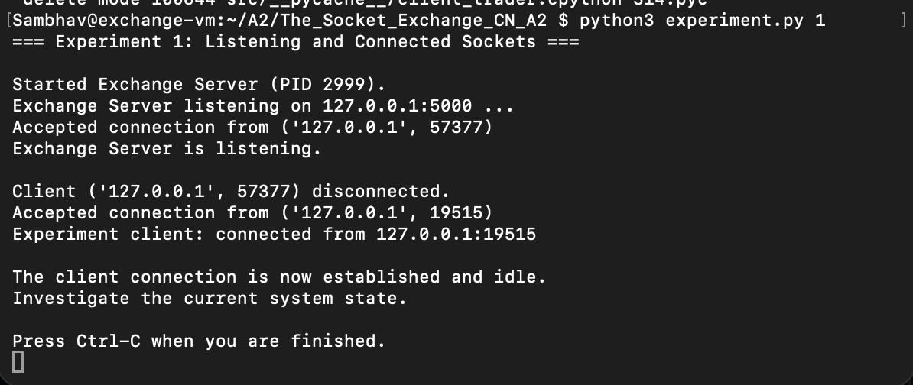

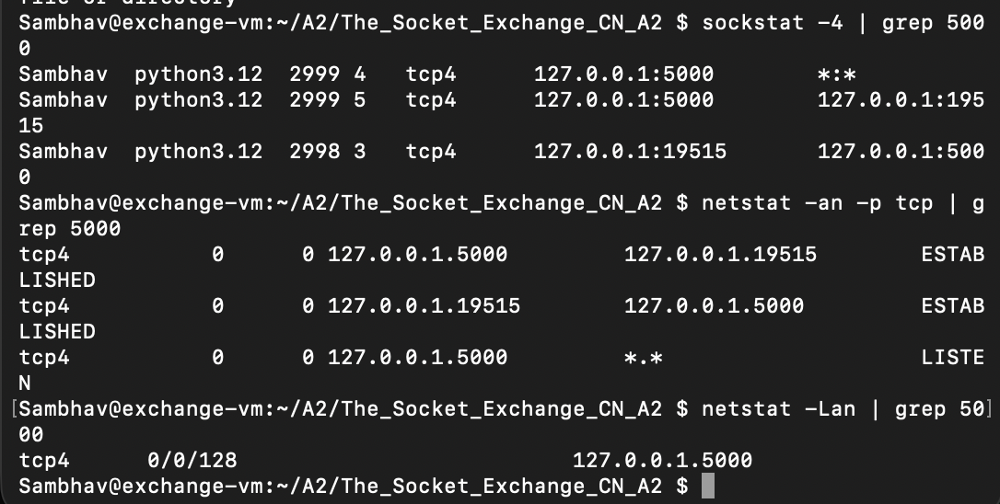

**What we see, and the answer.**

`sockstat` shows the server process (PID 2999) owning **two** sockets:

| fd | Local address | Foreign address |
|---|---|---|
| 4 | `127.0.0.1:5000` | `*:*` |
| 5 | `127.0.0.1:5000` | `127.0.0.1:19515` |

(The third line, fd 3 of PID 2998, is the client process's own end of the same connection.)

* **fd 4 is the listening socket.** Its foreign address is the wildcard `*:*`, `netstat -an` reports
  it in state **LISTEN**, and it is the only socket that appears in `netstat -Lan`, with the accept
  queue `0/0/128`. It has no peer and carries no application data; its only job is to hold the
  queue of incoming connections and hand out new descriptors from `accept()`.
* **fd 5 is the connected socket.** It has the *same* local port 5000 but a **fully specified**
  peer, `127.0.0.1:19515`, and is in state **ESTABLISHED**. This is the socket that `accept()`
  returned, and it is the one the server reads from and writes to.

So one port can serve many clients at once: a TCP connection is identified by the full 4-tuple
(local IP, local port, remote IP, remote port), so every accepted socket is distinct even though
they all share local port 5000.

---

### Experiment 2: Observing TCP Connection States

**What we are doing.** Watch one connection through its whole life (being set up, being alive,
and being closed by the client) and record both the states the kernel reports and the packets on
the wire.

**Commands and why.** The run is timed (10 s alive, then the close), so both observation terminals
are started *before* the harness.

| Terminal | Command | Why |
|---|---|---|
| 2 (root) | `tcpdump -ni lo0 -tttt -S -w .../exp2.pcap 'tcp port 5000'` | Records every packet on loopback for port 5000 into a file. `-S` prints absolute sequence numbers, `-tttt` prints full timestamps. |
| 3 (root) | `while :; do netstat -an -p tcp \| grep 5000; echo ---; sleep 0.5; done` | Polls the kernel's TCP state table twice a second, so we can catch the state changes as they happen. |
| 1 | `python3 experiment.py 2` | Runs the scenario. |
| 2 (root) | `tcpdump -nr .../exp2.pcap -tttt -S` | Replays the capture so the handshake and the teardown can be read segment by segment. |

**Screenshots.**

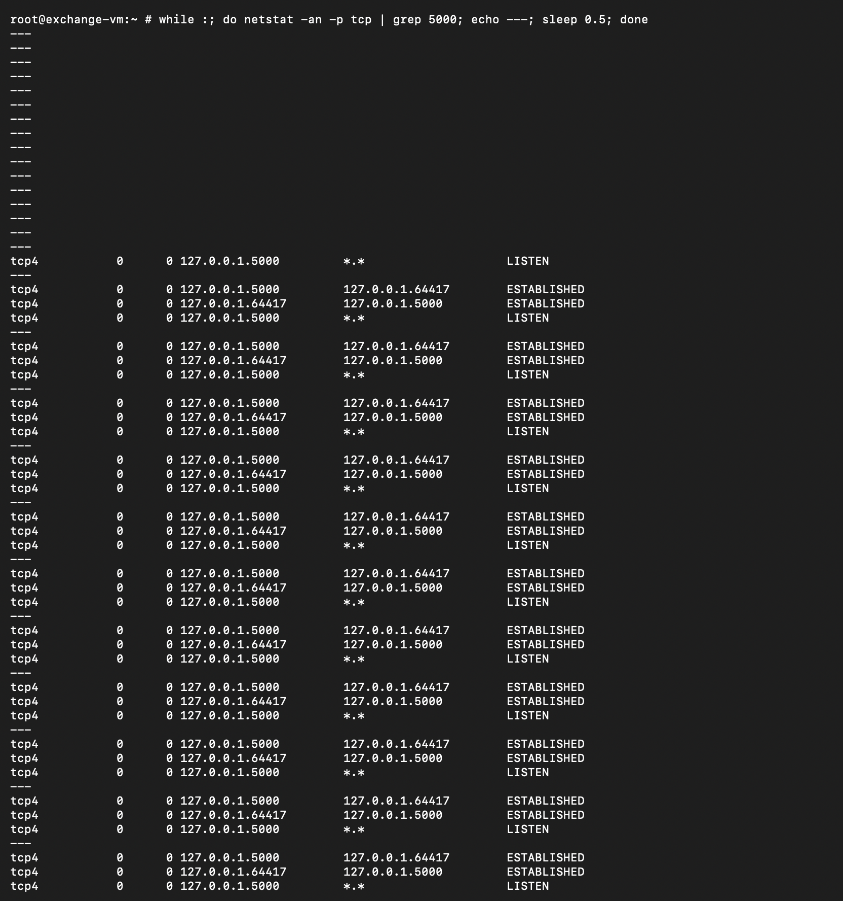

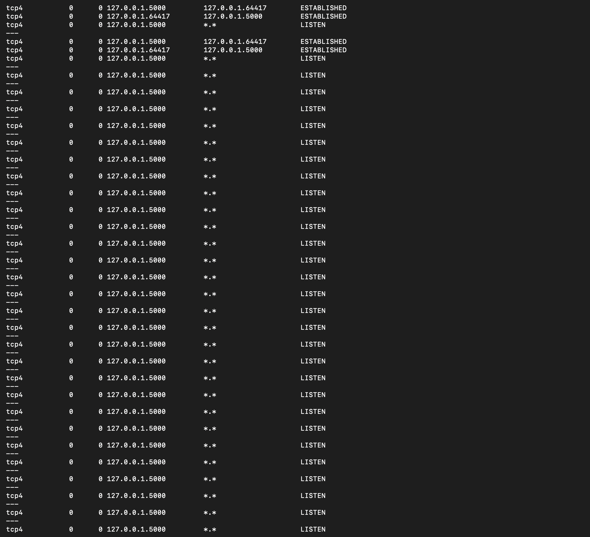

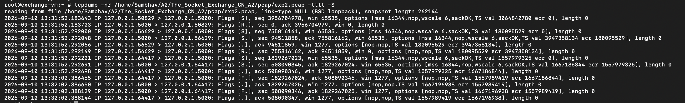

**What we see, and the answer.**

*While the connection is alive* (first screenshot), `netstat` shows three entries repeating every
half second:

```
127.0.0.1.5000   127.0.0.1.64417   ESTABLISHED   <- server's connected socket
127.0.0.1.64417  127.0.0.1.5000    ESTABLISHED   <- client's socket (the same connection, other end)
127.0.0.1.5000   *.*               LISTEN        <- listening socket, untouched
```

Both ends of the same connection are listed because both processes are inside this VM. The
listening socket is completely unaffected by the connection; it stays in `LISTEN` throughout.

*The packet trace* (third screenshot) shows the two halves of the life cycle:

**Setting up** (at 13:31:52.2922):

```
127.0.0.1.64417 > 127.0.0.1.5000: Flags [S]     <- SYN      (client connect())
127.0.0.1.5000 > 127.0.0.1.64417: Flags [S.]    <- SYN,ACK  (server's listen queue)
127.0.0.1.64417 > 127.0.0.1.5000: Flags [.]     <- ACK      -> both ends ESTABLISHED
```

This is the three-way handshake. The client passes through `SYN_SENT`, the server's new socket
through `SYN_RCVD`, and both reach `ESTABLISHED`. The event that causes it is the client's
`connect()` meeting the server's `accept()`.

**Tearing down** (10 seconds later, at 13:32:02.386):

```
127.0.0.1.64417 > 127.0.0.1.5000: Flags [F.]    <- client FIN   (client close())
127.0.0.1.5000 > 127.0.0.1.64417: Flags [.]     <- server ACK
127.0.0.1.5000 > 127.0.0.1.64417: Flags [F.]    <- server FIN
127.0.0.1.64417 > 127.0.0.1.5000: Flags [.]     <- client ACK
```

Four segments, in under 2 milliseconds. The chain of events explains why the server's FIN comes back so fast: the client's FIN makes the
kqueue read event fire, `self.conn.recv(4096)` in `ClientSession.run()` returns `b""` (end of
file), `run()` reports the connection closed, and `cleanup_session()` calls `conn.close()`, which
is what emits the server's own FIN.

**States, in order:** `LISTEN` / `SYN_SENT` → `SYN_RCVD` → `ESTABLISHED` (both ends) → client
`FIN_WAIT_1` → `FIN_WAIT_2` while the server is in `CLOSE_WAIT` → `LAST_ACK` on the server → both
closed.

Two things we could **not** catch with a 0.5 s poll, and why:

* **`CLOSE_WAIT` on the server is too short to see.** The server closes the descriptor in the very
  same pass of the event loop that saw the EOF, about 1.6 ms after the FIN arrives, per the
  timestamps. A server that ignored the EOF would sit in `CLOSE_WAIT` forever, which is exactly the
  bug that state is there to reveal.
* **No `TIME_WAIT` appears either** (second screenshot: the pair simply vanishes and only `LISTEN`
  is left). Normally the side that closes first lingers in `TIME_WAIT` for twice the maximum
  segment lifetime. FreeBSD does not create that entry for a purely local (loopback)
  connection, since there is no network path on which a delayed duplicate segment could still be
  wandering, so the entry is removed immediately.

The two extra packets at the top of the capture (`[R.]` at 13:31:52.1837 and 13:31:52.2921) are
not part of this connection: they are the harness's own probe that checks whether the server is up
yet. The first is the kernel refusing a connection before the server had bound the port; the second
is the probe socket being closed abortively.

---

### Experiment 3: TCP as a Byte Stream

**What we are doing.** The harness sends **one** application message,
`LOGIN experiment_trader\n`, as **four separate `send()` calls** (`"LOGIN "`, `"experiment"`,
`"_trader"`, `"\n"`) with a 0.2 s gap between them. We want to see how many `recv()` calls the
server needs to collect it.

**Commands and why.**

| Terminal | Command | Why |
|---|---|---|
| 1 | `env EXCHANGE_KTRACE=.../exp3.ktr python3 experiment.py 3` | Runs the scenario. `server/run-server` sees `EXCHANGE_KTRACE` and starts the server under `ktrace -i -t ci`, which records every **system call** the server makes. This is the only way to see the individual `recv()` calls; `tcpdump` would show packets, not the reads the application performed. |
| 2 | `kdump -f .../exp3.ktr \| grep -B1 -A2 recvfrom` | Turns the binary trace into text and keeps the `recvfrom` calls together with the data they returned. |

**Screenshots.**

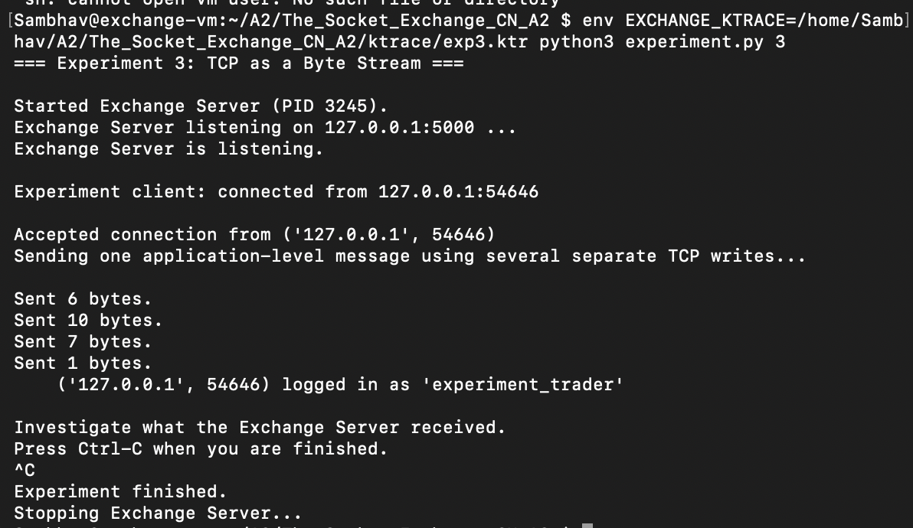

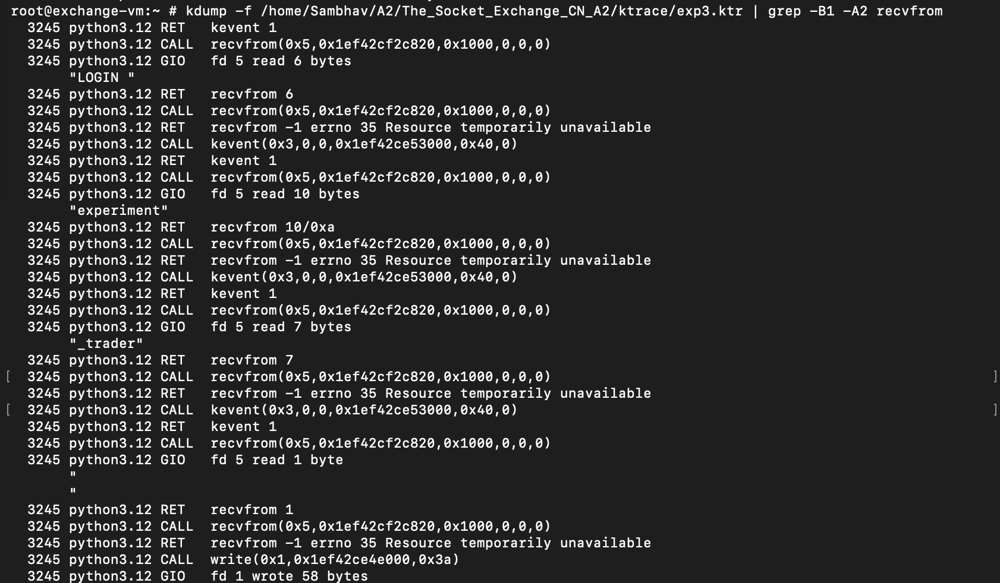

**What we see, and the answer.**

The harness reports `Sent 6 bytes. / Sent 10 bytes. / Sent 7 bytes. / Sent 1 bytes.`
The kernel trace of the server shows exactly the mirror image on fd 5:

```
kevent 1                     <- kqueue reports fd 5 readable
recvfrom(0x5, ...)  -> 6     "LOGIN "
recvfrom(0x5, ...)  -> -1 errno 35 (EAGAIN, nothing more right now)
kevent 1
recvfrom(0x5, ...)  -> 10    "experiment"
recvfrom ...        -> -1 errno 35
kevent 1
recvfrom(0x5, ...)  -> 7     "_trader"
recvfrom ...        -> -1 errno 35
kevent 1
recvfrom(0x5, ...)  -> 1     "\n"
recvfrom ...        -> -1 errno 35
write(0x1, ...)     -> 58 bytes   <- only now does the server log the login
```

**Answer: the message arrives in multiple pieces, four of them.** Because of the 0.2 s pause
between writes, each write turns into its own kqueue wakeup and its own `recvfrom`. The server did
nothing with the first three pieces; only when the fourth delivered the `\n` did it parse the line,
register the login and reply `OK` (visible as the harness printing
`('127.0.0.1', 54646) logged in as 'experiment_trader'`).

This demonstrates that **TCP preserves the order of bytes but not the sender's message
boundaries**: one `send()` does not correspond to one `recv()`. Application-level message
boundaries exist only because the *protocol* defines them: here, the newline. That is why the
server must keep a per-connection buffer and split on `\n` (Section 1.3) instead of assuming each
`recv()` returns a whole command.

The `errno 35` (`EAGAIN` / "Resource temporarily unavailable") lines are not errors: they are the
non-blocking socket telling the server "no more data right now", which is how `run()` knows to stop
reading and go back to the event loop instead of blocking.

---

### Experiment 4: One Client Should Not Stall the Others

**What we are doing.** Client 1 connects and sends `LOGIN blocked_client` **without a newline**,
then goes silent forever, so the server has an incomplete message it can never finish. Client 2
then connects and sends a complete message. The question is whether client 1's silence delays
client 2, and if the server is blocked anywhere.

**Commands and why.**

| Terminal | Command | Why |
|---|---|---|
| 1 | `python3 experiment.py 4` | Runs the scenario and, importantly, **times** how long client 2 waits for its reply. |
| 2 | `ps -o pid,wchan,%cpu,rss,command -p $(pgrep -f 'src/server.py')` | `wchan` is the kernel channel the process is **sleeping on**. This tells us exactly *where* the server is parked, which is the heart of the question. `%cpu` tells us whether it is busy-waiting instead. |
| 2 | `netstat -an -p tcp \| grep 5000` | Shows both connections and, in particular, the `Recv-Q` column, which is how many bytes are still sitting unread in the kernel. |

**Screenshots.**

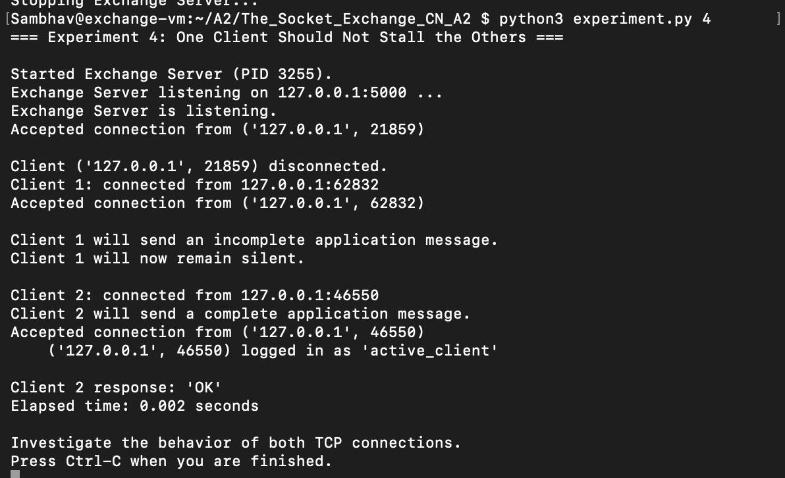

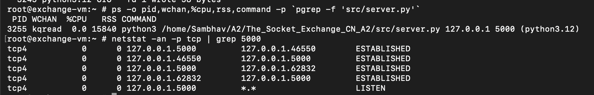

**What we see, and the answer.**

**Answer: yes, the server services client 2 normally.** The harness reports
`Client 2 response: 'OK'` with `Elapsed time: 0.002 seconds`, two milliseconds, while client 1
is still sitting mid-message. Note that client 2 was even *accepted* after client 1 went silent
(`Accepted connection from ('127.0.0.1', 46550)`), so the idle client did not block `accept()`
either.

The `ps` output identifies the operation that decides this:

```
PID   WCHAN    %CPU   RSS     COMMAND
3255  kqread   0.0    15840   python3 .../src/server.py 127.0.0.1 5000
```

* `WCHAN = kqread` means the server is sleeping inside **`kq.control(None, 64, None)`**, the
  readiness wait, and **not** inside a `recv()` on any particular client. This is the whole point:
  the server never commits itself to one client. It asks the kernel "wake me when *any* socket has
  something", so an idle client simply never appears in the returned event list.
* `%CPU = 0.0` shows it is not busy-polling either; it is genuinely asleep until work arrives.

`netstat` shows all four socket entries (both ends of both connections) `ESTABLISHED`, plus the
`LISTEN` socket, and every `Recv-Q` is **0**. That last detail is worth noting: client 1's
incomplete `LOGIN blocked_client` is *not* stuck in the kernel. The server already read those
bytes, found no `\n`, left them in that session's `in_buf`, and returned to the event loop. The
partial message is parked in the server's own per-connection buffer, costing nothing.

For contrast: a server that used a blocking `recv()` per client in turn would stall inside client
1's `recv()` and would never reach `accept()` for client 2; the elapsed time would have been
"forever" instead of 2 ms.

---

### Experiment 5: Multiple Clients and I/O Multiplexing *(optional)*

**What we are doing.** Five clients connect at the same time. Clients 1, 3 and 5 each send one
message; clients 2 and 4 stay completely silent. We want to determine, from the running system,
*which* connections were actually ready for the server to service.

**Commands and why.**

| Terminal | Command | Why |
|---|---|---|
| 1 | `env EXCHANGE_KTRACE=.../exp5.ktr python3 experiment.py 5` | Runs the scenario with syscall tracing on, so we can see which descriptors the kqueue actually reported. |
| 2 | `netstat -an -p tcp \| grep 5000` | Shows all five connections at once and their `Recv-Q`, i.e. which ones have data associated with them. |
| 2 | `kdump -f .../exp5.ktr \| grep -E 'kevent\|recvfrom'` | The decisive evidence: the sequence of `kevent` returns and the `recvfrom` calls the server made in response, with the file descriptor number in the first argument. |

**Screenshots.**

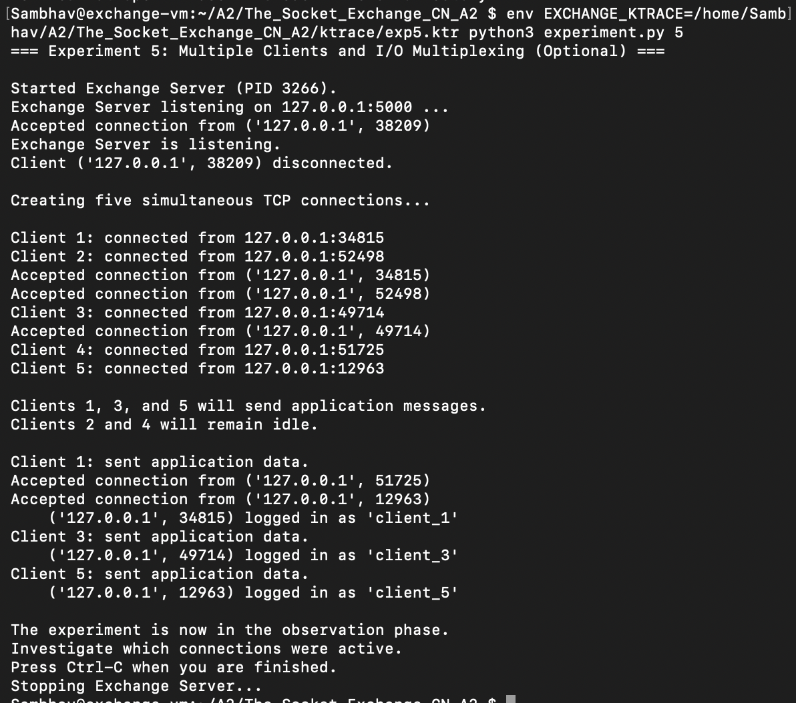

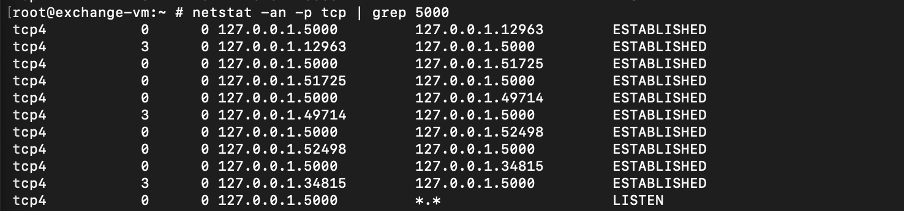

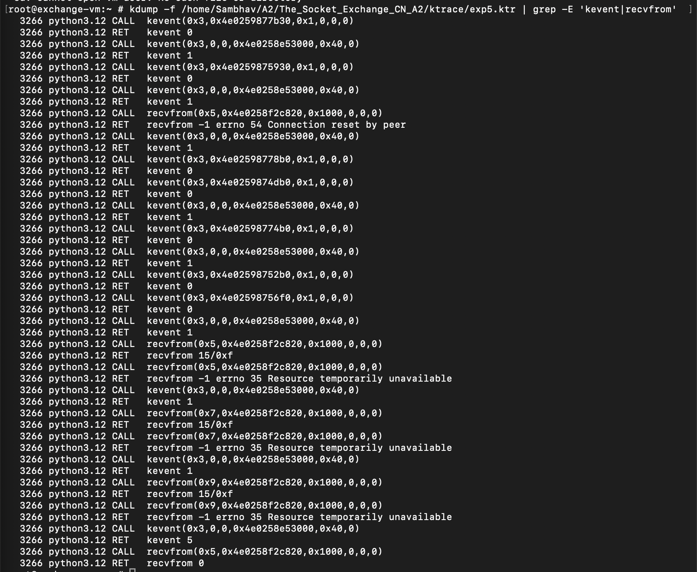

**What we see, and the answer.**

**Answer: only clients 1, 3 and 5 were ever ready. Clients 2 and 4 produced no events at all.**

Two independent pieces of evidence say so.

*From the syscall trace:* each time `kevent` returns 1, the server immediately issues a
`recvfrom`, and the fd it reads is always `0x5`, `0x7` or `0x9`, each returning **15 bytes**
(`LOGIN client_N\n` is exactly 15 bytes). Descriptors `0x6` and `0x8`, the two idle clients,
never appear in a single `recvfrom` in the whole trace. Each read is followed by a second
`recvfrom` returning `errno 35` (nothing more to read) and then straight back to `kevent`, i.e.
back to sleep.

*From netstat:* all five connections (ten entries, both ends of each) are `ESTABLISHED`, but the
`Recv-Q` column distinguishes them. Ports `34815`, `49714` and `12963`, clients 1, 3 and 5, show
`Recv-Q = 3` on the *client* side: that is the 3-byte `OK\n` reply the server sent them and they
have not read. Clients 2 and 4 (ports `52498`, `51725`) have `Recv-Q = 0` at both ends: nothing
was ever sent to them and nothing ever arrived from them.

The conclusion is that **what drives work in a multiplexed server is readiness, not
connectedness.** Five open connections cost the same as three when two of them are silent: the
idle sockets are registered with the kqueue but never enter the returned event list, so the server
never touches them. (The `kevent 5` near the end of the trace, followed by `recvfrom` returning 0,
is the teardown at the end of the run: all five sockets become readable at once because all five
clients closed, and each read returns EOF.)

---

### Experiment 6: FIN vs. RST, Orderly and Abrupt Termination

**What we are doing.** The same connection is closed in two different ways, back to back.
In **Part A** the client calls `shutdown(SHUT_WR)`, the polite "I'm done sending". In **Part B**
the client sets `SO_LINGER` to zero and calls `close()`, the abrupt kill. We compare what appears
on the wire and what the server's socket sees.

**Commands and why.**

| Terminal | Command | Why |
|---|---|---|
| 2 (root) | `tcpdump -ni lo0 -tttt -S 'tcp port 5000'` | Live packet view (no `-w` this time, so we can watch the flags appear in real time and screenshot each phase as it happens). The `[F.]` and `[R]` flags in the output are the whole answer. |
| 1 | `python3 experiment.py 6` | Runs part A (10 s) then part B (15 s). |

**Screenshots.**

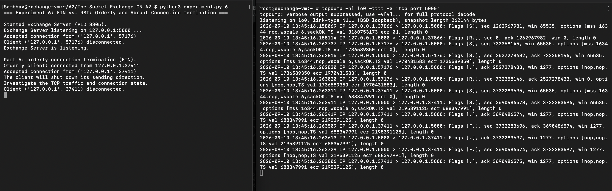

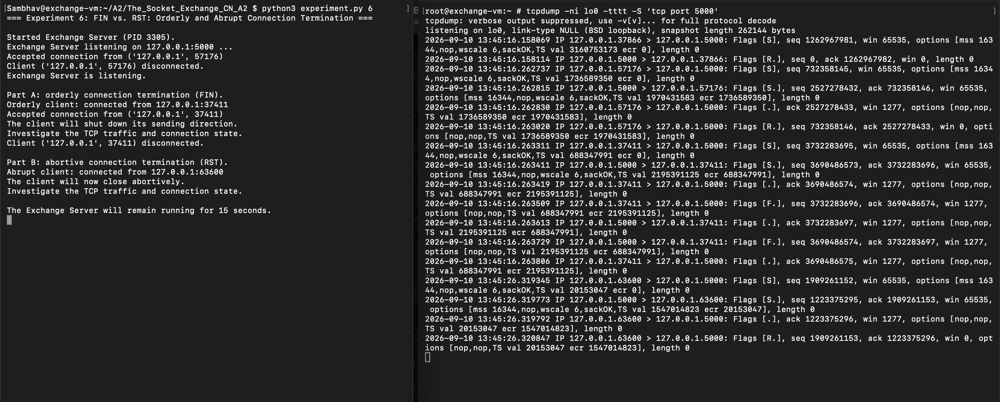

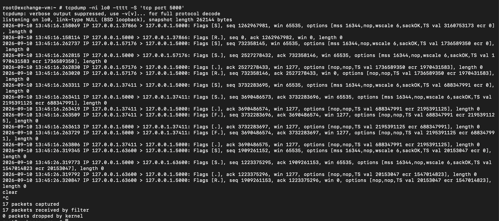

**What we see, and the answer.**

**Part A, orderly (connection from port 37411), four segments in 0.3 ms:**

```
13:45:16.263509  127.0.0.1.37411 > 127.0.0.1.5000: Flags [F.]   <- client's FIN (shutdown(SHUT_WR))
13:45:16.263613  127.0.0.1.5000 > 127.0.0.1.37411: Flags [.]    <- server ACKs it
13:45:16.263729  127.0.0.1.5000 > 127.0.0.1.37411: Flags [F.]   <- server's own FIN
13:45:16.263806  127.0.0.1.37411 > 127.0.0.1.5000: Flags [.]    <- client ACKs that
```

On the server the sequence is the familiar one: the read event fires, `recv()` returns `b""`,
`ClientSession.run()` reports the connection closed, and `cleanup_session()` closes the descriptor,
which is what puts the server's FIN on the wire. The harness's own log confirms it:
`Client ('127.0.0.1', 37411) disconnected.` The FIN is **part of the protocol**: it is
acknowledged, it is sequenced, and any data sent before it is still delivered.

**Part B, abrupt (connection from port 63600), one segment and it's over:**

```
13:45:26.319345  127.0.0.1.63600 > 127.0.0.1.5000: Flags [S]    <- connect
13:45:26.319773  127.0.0.1.5000 > 127.0.0.1.63600: Flags [S.]
13:45:26.319792  127.0.0.1.63600 > 127.0.0.1.5000: Flags [.]    <- established
13:45:26.320847  127.0.0.1.63600 > 127.0.0.1.5000: Flags [R.]   <- RST, and that is all
```

Setting `SO_LINGER` to 0 and calling `close()` makes TCP send a **reset** instead of a FIN. Note
what is *missing* after it: no ACK of the reset, no FIN from the server, no `TIME_WAIT`. The
connection is simply destroyed at both ends. On the server, `self.conn.recv(4096)` raises
`ConnectionResetError`, which `run()` catches as a hard error and tears the session down through
the same `cleanup_session()` path.

**The difference in one line:**

> **FIN means "I have finished sending" and is part of the normal protocol; RST means "this
> connection no longer exists" and is an abort.**

FIN is a half-close: the other direction stays open until it too is closed, and data already in
flight is still delivered. RST is immediate and discards anything still buffered or in flight,
which is why an abrupt close can lose data that a FIN close would not. Our server treats both the
same way (one `cleanup_session()` path) and does not attempt to flush a departing client's
`out_buf`, so buffered output is dropped in either case, but only the RST path can lose bytes
that were already on the wire.

*(The `[R.]` at 13:45:16.158114 and 13:45:16.263020 at the top of the capture belong to the
harness's start-up probe, not to either test connection.)*

---

### Experiment 7: Backpressure and the Slow Receiver

**What we are doing.** Two Market-Data Clients subscribe to `JNST`. One reads its updates normally;
the other deliberately **stops reading**. The harness then generates 5,000 matching trades, so the
server has a sustained stream of `TRADE` messages to push at both of them. We want to see what
happens to the stalled connection, and whether it damages the server's ability to talk to anyone
else.

**Commands and why.**

| Terminal | Command | Why |
|---|---|---|
| 3 (root) | `sysctl net.inet.tcp.sendspace=4096` `recvspace=4096` `sendbuf_auto=0` `recvbuf_auto=0` | Shrinks the socket buffers **before the server starts**. At the defaults (32 KB / 64 KB with auto-tuning) the whole run is only ~85 KB of `TRADE` text, so it would fit in the buffers and nothing interesting would ever happen. A sysctl only affects **newly created** sockets, which is why it has to come first. |
| 2 (root) | `tcpdump -ni lo0 -tttt -S 'tcp port 5000'` | Live packet view. The `win` field on every ACK is what TCP flow control actually looks like on the wire, and this is the only place you can watch the receiver advertise how much room it has left. |
| 1 | `python3 experiment.py 7` | Runs the scenario. It takes several minutes. |
| 3 (root) | `netstat -an -p tcp \| grep 5000` | The decisive comparison: `Recv-Q` and `Send-Q` for the slow subscriber next to the same columns for the normal one. |
| 3 (root) | `ps -o pid,wchan,%cpu,rss -p $(pgrep -f 'src/server.py')` | Answers "is the server stalled, and is it leaking memory?" `wchan` says where it is sleeping, `rss` says how much the buffered output is costing. |
| 3 (root) | `sysctl ... sendspace=32768 recvspace=65536 sendbuf_auto=1 recvbuf_auto=1` | Puts the buffers back afterwards, so Experiment 8 and the bonus are not distorted. |

**Screenshots.**

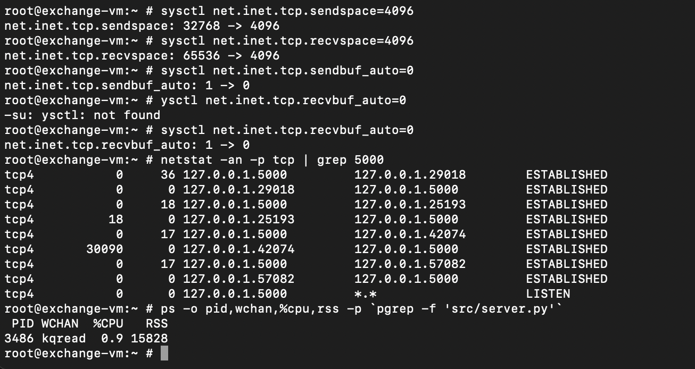

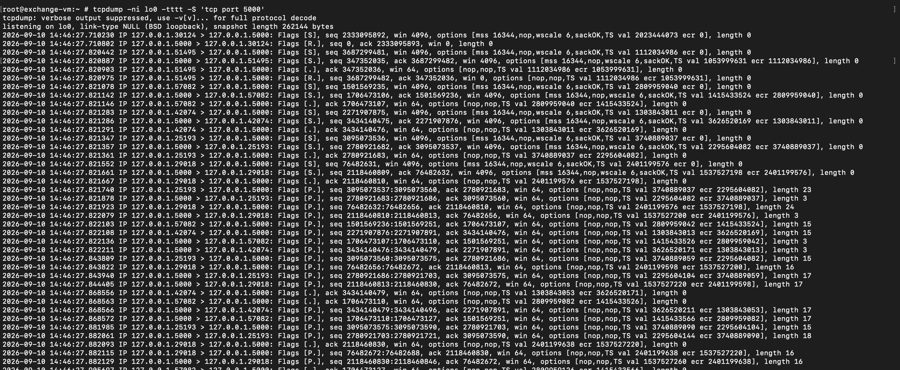

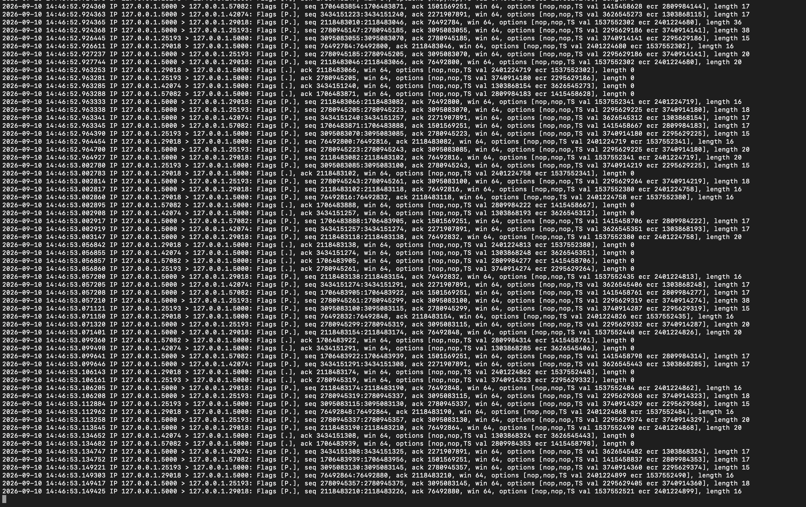

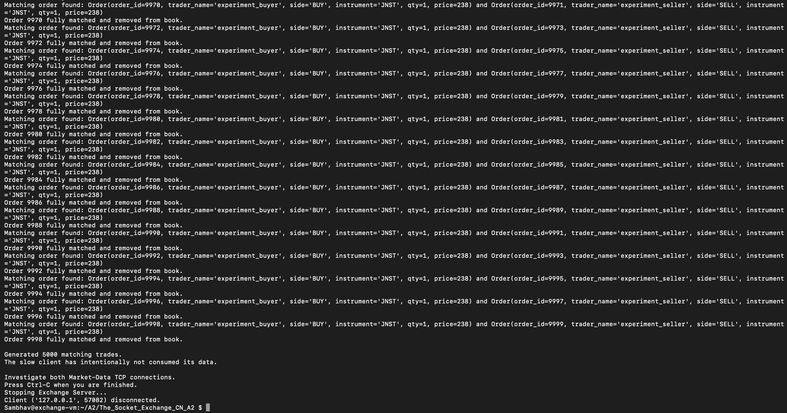

**What we see, and the answer.**

There are four client connections in this run. Ports **29018** and **25193** are the two Trader
Clients, **42074** is the **slow** Market-Data Client, and **57082** is the **normal** one.

*The queues - this is the whole answer in one table.* From `netstat -an -p tcp | grep 5000`
(columns are `Recv-Q`, `Send-Q`, local, foreign):

```
Recv-Q  Send-Q   Local              Foreign
     0      36   127.0.0.1.5000     127.0.0.1.29018    ESTABLISHED   <- trader
     0       0   127.0.0.1.29018    127.0.0.1.5000     ESTABLISHED
     0      18   127.0.0.1.5000     127.0.0.1.25193    ESTABLISHED   <- trader
    18       0   127.0.0.1.25193    127.0.0.1.5000     ESTABLISHED
     0      17   127.0.0.1.5000     127.0.0.1.42074    ESTABLISHED   <- SLOW subscriber
 30090       0   127.0.0.1.42074    127.0.0.1.5000     ESTABLISHED   <- 30 KB piled up unread
     0      17   127.0.0.1.5000     127.0.0.1.57082    ESTABLISHED   <- normal subscriber
     0       0   127.0.0.1.57082    127.0.0.1.5000     ESTABLISHED   <- drained, nothing waiting
```

**The connection to the slow client backs up, and the backup is confined to that one connection.**
The slow client has **30,090 bytes** of `TRADE` lines sitting unread in its own receive buffer,
while the normal subscriber's `Recv-Q` is **0**, since it consumes each update as it arrives. Same
server, same instrument, same trades: the only difference is that one process stopped calling
`recv()`.

*How TCP applies the pressure.* In the packet trace, every connection negotiated `wscale 6` and a
4 KB window at handshake time (`win 4096` in the SYNs, then `win 64` afterwards, because tcpdump
prints the raw window field, so 64 × 2⁶ = 4096 bytes). Each `TRADE JNST 1 238\n` is 17 bytes, and the
server's TCP is only ever allowed to send as much as the receiver's advertised window permits.
That advertised window is the mechanism: as the slow client's buffer fills, the window it
advertises shrinks, and the server's TCP throttles **that connection alone**. Nothing about this
reaches the other three sockets.

*The other clients are provably unaffected.* In the steady-state trace, single milliseconds contain
deliveries to everybody at once, e.g. at 14:46:53.057:

```
14:46:53.057200  5000 > 29018:  [P.] length 16   <- trader gets its notification
14:46:53.057205  5000 > 42074:  [P.] length 17   <- slow subscriber still being written to
14:46:53.057208  5000 > 57082:  [P.] length 17   <- normal subscriber, same instant
14:46:53.057210  5000 > 25193:  [P.] length 38   <- other trader
```

Five microseconds apart. The two traders keep exchanging orders and receiving `BOUGHT`/`SOLD`
lines for the entire run, and the harness finishes all 5,000 trades and reports
`Generated 5000 matching trades. The slow client has intentionally not consumed its data.`

*The server is not stalled and is not growing.* `ps` reports:

```
PID   WCHAN    %CPU   RSS
3486  kqread   0.9    15828
```

Still asleep in `kqread`, the same place it sits when completely idle, at under 1 % CPU. And the
`RSS` of **15,828 KB** is essentially identical to the **15,840 KB** measured in Experiment 4 with
only two connections and no traffic at all. So the stalled client cost the server no measurable
memory in this run.

**One honest qualification.** This run never reached a hard **zero window**. The slow client's ACKs
hold at `win 64` rather than collapsing to `win 0`, and correspondingly the server's `Send-Q` for
that connection stays at 17 bytes rather than filling up. Two reasons: each `TRADE` is only 17
bytes, so the stream trickles rather than floods; and `net.inet.tcp.recvspace` sets only the
*initial* buffer size, so that socket's buffer was evidently larger than the 4 KB we asked for,
which is consistent with the 30 KB actually queued in it.

Because the window never hit zero, the server's own buffering path was never triggered: no
`Warning: N bytes unsent to ..., buffering for later` lines appear in terminal 1. That path is
nevertheless the designed answer to this exact situation, and it is worth stating what *would*
have happened had the stream been fatter: once the window reaches 0 the server's send buffer fills,
`self.conn.send(payload)` in `ClientSession.send()` raises `BlockingIOError`, the caught exception
sets `sent_bytes = 0`, the entire payload is appended to that client's `out_buf`, a
`KQ_FILTER_WRITE` filter is armed for its fd, and the event loop carries straight on to the other
clients. Because the socket is non-blocking, the server never waits on the slow peer. TCP keeps
the connection alive with zero-window probes, so nothing is lost on the wire.

The cost of that design, noted in Section 1.4, is memory: `out_buf` is unbounded, so a client that
stays stuck indefinitely would make the server's `RSS` grow without limit. At 85 KB the harness
never gets near that, but a sustained real feed eventually would, and a hardened server would cap
the backlog and disconnect a client that exceeded it.

---

### Experiment 8: Unexpected Client Disconnection

**What we are doing.** Two Market-Data Clients subscribe to `JNST`. One of them stops reading and
is then killed with `SIGKILL`, so the process disappears without ever calling `close()`. We want
to find out what happens to its TCP connection, how the server notices, and whether the other client
is affected.

**Commands and why.**

| Terminal | Command | Why |
|---|---|---|
| 2 (root) | `tcpdump -ni lo0 -tttt -S -w .../exp8.pcap 'tcp port 5000'` | Records everything, including the hundreds of `TRADE` messages, so the disconnection can be examined afterwards without the interesting packets scrolling away. |
| 1 | `python3 experiment.py 8` | Runs the scenario and announces when the client has been killed. |
| 3 | `netstat -an -p tcp \| grep 5000`, run once **before** the kill and once **after** | Direct before/after comparison: which connections survive and which one disappears. |
| 2 (root) | `tcpdump -nr .../exp8.pcap -tttt -S 'tcp[tcpflags] & (tcp-fin\|tcp-rst) != 0'` | Filters the 874 captured packets down to **only** the connection-termination segments, so the one that ended the dead client's connection is immediately visible. |

**Screenshots.**

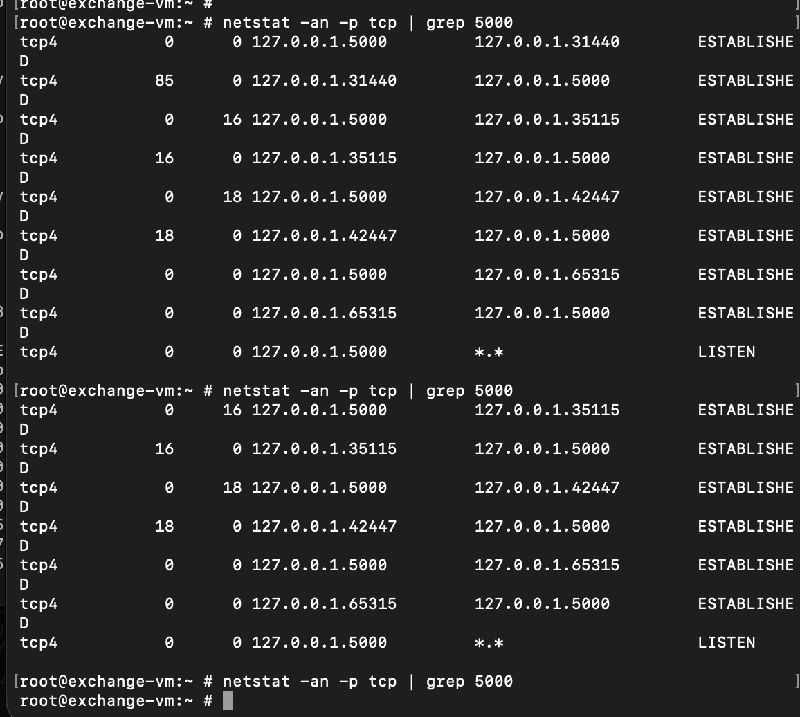

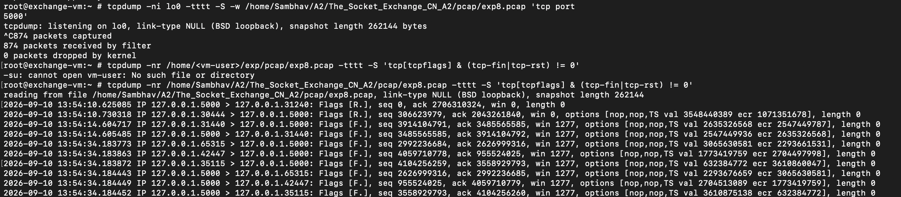

**What we see, and the answer.**

*The before/after comparison.* The first `netstat` listing shows four connections. The one from
port **31440** is the doomed client, and it is visibly unhealthy: its client-side entry has
`Recv-Q = 85`, i.e. 85 bytes of `TRADE` messages that the server delivered and the client never
read. The second listing, taken after the harness announced the kill, has that connection **gone**
and the other three still `ESTABLISHED`, including the surviving subscriber, which keeps receiving
trades for the rest of the run. (The third listing is empty because it was taken after the run
ended and the server was stopped.)

*What went on the wire.* Filtering the capture to FIN/RST segments shows, at 13:54:14.60:

```
13:54:14.604717  127.0.0.1.31440 > 127.0.0.1.5000: Flags [F.]   <- FIN from the dead client
13:54:14.605485  127.0.0.1.5000 > 127.0.0.1.31440: Flags [F.]   <- server's FIN back, 0.8 ms later
```

**The process died, but the kernel still closed its socket**: the socket belongs to the kernel,
not to the process, so when the process is destroyed the kernel runs the close for it. On this
FreeBSD VM that close produced a **normal FIN exchange**, even though 85 bytes were still sitting
unread in the receive buffer: FreeBSD discards the queued receive data and performs the orderly
close anyway. (On Linux the same situation would produce an `RST`, because Linux refuses to imply
that unread data was consumed. This is the one place where the two systems visibly disagree, and
it is worth reporting the FreeBSD behaviour as we actually measured it rather than the textbook
answer.) The only genuine `RST`s in the capture, at 13:54:10.62 and 13:54:10.73, before the
market-data clients even existed, belong to the harness's start-up probe. The remaining `[F.]`
pairs at 13:54:34 are the normal shutdown of the other three clients at the end of the run.

**How the server detects it: not by any timeout.** The kqueue read filter for that socket fires on
the very next pass of the event loop; `self.conn.recv(4096)` returns `b""` (or raises
`ConnectionResetError` had it been a reset); `ClientSession.run()` returns `False`; and
`cleanup_session(fd)` pops the session out of the `sessions` dict, discards its username, and
closes the descriptor. Because the session is no longer in `sessions`, the `inform()` broadcast
loop simply stops addressing `TRADE` lines to that peer, and no error handling special case is
needed anywhere.

**The comparison.** One client's death removed exactly one file descriptor and one subscription.
The surviving subscriber received every trade generated after the kill, and the server never
paused. One extra point worth making: **a half-open connection is invisible until you try to use
it.** If the server had been idle, it would have learned nothing about the dead peer, which is
precisely why the harness keeps generating trades after the kill.

---

## 3. Bonus: Connection Scalability and I/O Design

**What we are doing.** Open up to 70,000 simultaneous **idle** TCP connections to the Exchange
Server and measure what each one costs. The connections never send `LOGIN` or `SUBSCRIBE`, so on
the server each is an accepted socket with a `ClientSession` whose `client_type` is still `None`.
That is the pure per-connection cost with nothing else mixed in.

### 3.1 Setup

Idle connections are cheap, but 70,000 of them run into three separate OS ceilings, so all three
have to be raised before starting.

| Command | Why |
|---|---|
| `sysctl kern.maxfiles=500000` `kern.maxfilesperproc=400000` | Every connection is a file descriptor on the server **and** another on the generator, so 70,000 connections need ~140,000 descriptors system-wide. The defaults are far below that. |
| `sysctl kern.ipc.soacceptqueue=8192` | The generator connects far faster than the server accepts, so the listen backlog must be deep enough to absorb the burst; otherwise connections are refused with `ECONNREFUSED`. |
| `sysctl net.inet.tcp.sendspace=4096 recvspace=4096` | Keeps the per-socket buffer reservation small. Since the connections are idle this mostly does not matter (see the mbuf column below), but it removes any doubt. |
| `sysctl net.inet.ip.portrange.first=1024 last=65535 randomized=0` | Widens the ephemeral-port range to its maximum and makes allocation sequential, so the generator does not waste time colliding on random ports. |
| `ifconfig lo0 alias 127.0.0.2/32` and `127.0.0.3/32` | **The important one.** A connection is identified by the 4-tuple (src IP, src port, dst IP, dst port). With one source address the destination fixed at `127.0.0.1:5000`, only the source port varies, giving about 64,500 possible values, so ~64,500 connections maximum. Two extra loopback addresses triple that ceiling. |
| `ulimit -n 400000` in both the server's and the generator's shell | The per-process descriptor limit is inherited from the shell, so it has to be raised in each terminal before launching. |

**The load generator.** `client_generation.py` opens the requested number of connections, cycles
through the source addresses it is given, and then holds them open without exchanging any
application data. It raises its own `RLIMIT_NOFILE` to the hard limit so that the *generator* is
never the thing that runs out of descriptors first, and it reports any failures grouped by `errno`
name, which is what question 2 needs.

```
# terminal 1 (root): the server
ulimit -n 400000
./server/run-server 127.0.0.1 5000

# terminal 2 (root): the load
ulimit -n 400000
python3 client_generation.py 127.0.0.1 5000 <N> 127.0.0.1 127.0.0.2 127.0.0.3

# terminal 3 (root): the measurements, taken while the N connections are held
ps -o pid,rss,vsz,%cpu -p `pgrep -f 'src/server.py'`
procstat -f `pgrep -f 'src/server.py'` | wc -l
sysctl kern.openfiles kern.maxfiles
netstat -m | head -5
netstat -an -p tcp | grep -c '\.5000.*ESTABLISHED'
```

> **Reading the connection count.** `netstat -an -p tcp | grep -c '\.5000.*ESTABLISHED'` counts
> **both ends** of every connection, because the generator and the server are both inside this VM
> and both appear in the same table. So the printed number is exactly **twice** the number of
> connections: `20000` means 10,000 connections, `140000` means 70,000. Every count came out at
> exactly 2 × N, which is itself the proof that no connection was lost.

### 3.2 The measurement table

All values are read from the screenshots below, taken while the stated number of connections were
simultaneously established and idle.

| Idle connections | Server memory (RSS) | Server VSZ | Server CPU | Open fds (server) | System-wide open fds / limit | Socket-buffer (mbuf) usage | Max connections established |
|---|---|---|---|---|---|---|---|
| 0 *(baseline)* | 16,056 KB | 27,960 KB | 0.0 % | 9 | 128 / 500,000 | 577 mbufs, **0** clusters | n/a |
| 10,000 | 31,800 KB | 42,296 KB | 0.0 % | 10,009 | 20,128 / 500,000 | 579 mbufs, **0** clusters | 10,000 ✓ |
| 20,000 | 47,752 KB | 60,728 KB | 1.0 % | 20,009 | 40,128 / 500,000 | 579 mbufs, **0** clusters | 20,000 ✓ |
| 30,000 | 64,332 KB | 76,088 KB | 2.1 % | 30,009 | 60,128 / 500,000 | 577 mbufs, **0** clusters | 30,000 ✓ |
| 40,000 | 80,924 KB | 95,032 KB | 3.8 % | 40,009 | 80,126 / 500,000 | 577 mbufs, **0** clusters | 40,000 ✓ |
| 50,000 | 98,796 KB | 114,488 KB | 6.0 % | 50,009 | 100,126 / 500,000 | 577 mbufs, **0** clusters | 50,000 ✓ |
| 60,000 | 116,680 KB | 134,968 KB | 6.5 % | 60,009 | 120,126 / 500,000 | 577 mbufs, **0** clusters | 60,000 ✓ |
| 70,000 | 137,116 KB | 157,496 KB | 3.9 % | 70,009 | 140,126 / 500,000 | 577 mbufs, **0** clusters | **70,000 ✓** |

*Notes on the columns.* "Open fds (server)" is `procstat -f | wc -l` minus the header line; the
baseline of 9 covers stdin/stdout/stderr, the working directory, the executable, the listening
socket and the kqueue, and every connection adds exactly one more. "System-wide open fds" is
`kern.openfiles`, which counts the generator's descriptors too, hence roughly 2 × N + 128.
"Socket-buffer usage" is the first two lines of `netstat -m`.

**Screenshots.** (Required at 10,000 / 40,000 / 70,000; the baseline is included because
per-connection cost is meaningless without it.)

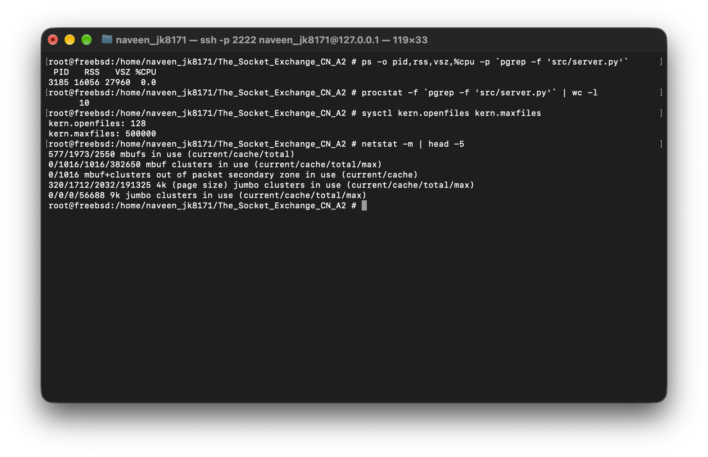

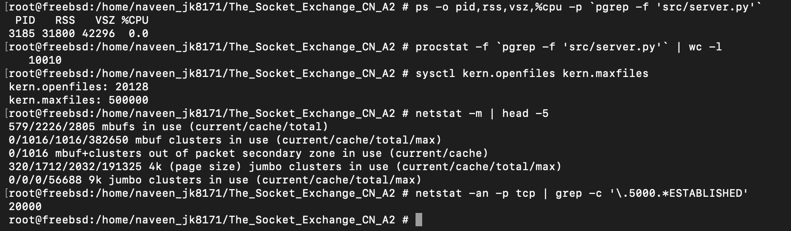

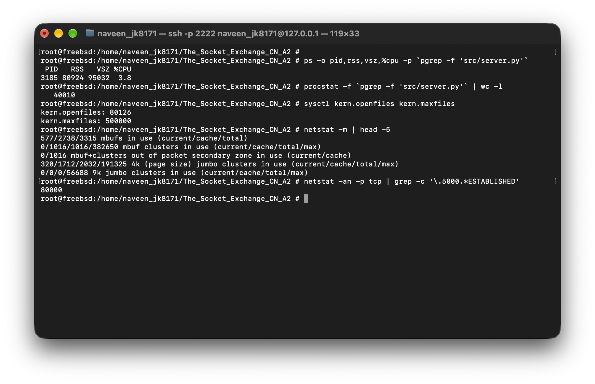

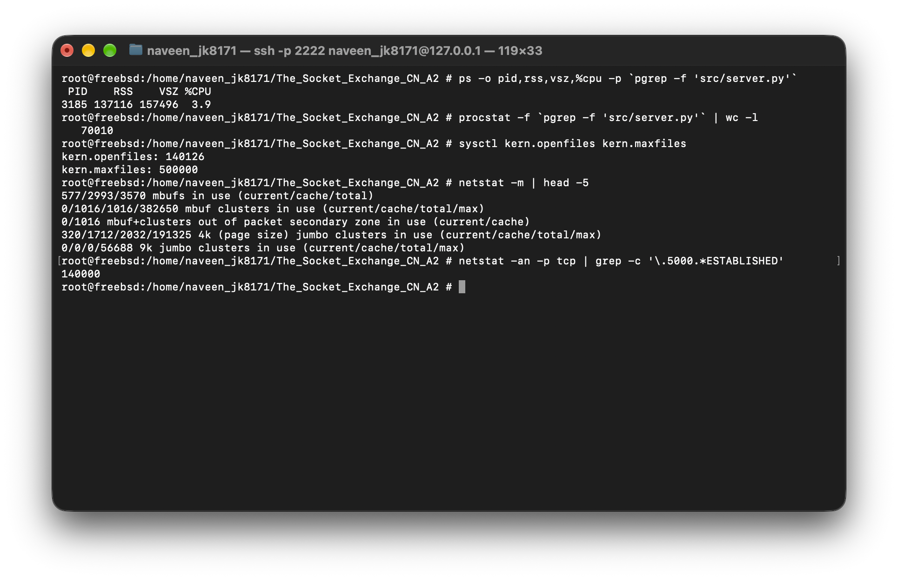

Supporting measurements for the intermediate rows:
[20,000](report_images/bonus_20k.png) · [30,000](report_images/bonus_30k.png) ·
[50,000](report_images/bonus_50k.png) · [60,000](report_images/bonus_60k.png)

### 3.3 Analysis

**1. At each connection count, does the server maintain all requested connections?**

**Yes, every single one, all the way to 70,000.** At every step the connection count came out at
exactly 2 × N (`20000`, `40000`, `60000`, `80000`, `100000`, `120000`, `140000`) and the server's
own descriptor count at exactly N + 9. Nothing was dropped, and the generator reported no `errno`
failures at any level. **There is no connection count at which it first fails within the range the
assignment asks for.**

**2. What is the first significant bottleneck?**

Nothing was exhausted at 70,000, so the honest answer is that **the first bottleneck was not
reached**, but the table makes it clear which resource is heading for the wall first, and it is
**not** the one people usually expect.

* **Memory grows linearly and is the only thing that visibly grows.** Subtracting the 16,056 KB
  baseline gives a very steady per-connection cost:

  | Connections | RSS above baseline | Per connection |
  |---|---|---|
  | 10,000 | 15,744 KB | 1.57 KB |
  | 30,000 | 48,276 KB | 1.61 KB |
  | 50,000 | 82,740 KB | 1.65 KB |
  | 70,000 | 121,060 KB | **1.73 KB** |

  Straight-line growth of roughly **1.6–1.7 KB per idle connection**, drifting up very slightly as
  the `sessions` dict is resized. Note there is no power-of-two `realloc` staircase here as there
  would be in a C server; the cost is per-object Python allocation.
* **File descriptors are at 28 % of the limit** (140,126 of 500,000) and are not close to
  binding.
* **CPU is negligible and does not accumulate.** It peaks at 6.5 % and *falls back to 3.9 %* at
  70,000, because `ps` reports a decaying average and the CPU is spent **accepting** connections,
  not holding them. Once the connections are established and idle, the server goes back to sleep in
  `kqread`. Holding 70,000 idle sockets costs essentially nothing.
* **Socket buffers cost nothing at all**, and this is the most interesting row in the table.
  `netstat -m` reports **577 mbufs in use and 0 mbuf clusters** at 70,000 connections, the same as
  at zero. `sendspace`/`recvspace` are only a *limit* on how much a socket may buffer; the kernel
  allocates mbufs lazily, when there is actually data. An idle connection carries no data, so it
  consumes no socket-buffer memory whatsoever.

  This is worth stating plainly because it contradicts the natural guess: 70,000 × 4 KB of receive
  buffer would be 280 MB, but the measured socket-buffer usage is **zero**.

*Extrapolating past the measured range*, the next wall would be **ephemeral ports**, not memory:
three source addresses × ~64,500 usable ports ≈ **193,500 connections**, at which point the
generator would start failing with `EADDRNOTAVAIL` (errno 49). File descriptors would follow at
250,000 connections (500,000 system-wide ÷ 2 descriptors each). Memory would only become the
constraint far beyond that: at 1.7 KB each, the 6 GB VM could in principle hold millions. The
usual `errno` values to watch for are `EMFILE` (24, descriptor limit), `EADDRNOTAVAIL` (49, ports
exhausted) and `ECONNREFUSED` (61, accept queue overflowed).

**3. How does our concurrency/I/O design contribute to the observed bottleneck?**

The server is **single-threaded with `select.kqueue()`**, with one process and no thread or
process per connection (Section 1.2). That is exactly why the table looks the way it does:

* There is no per-connection stack, so memory grows by ~1.7 KB rather than the ~8 MB of virtual
  address space (and several KB of real memory) a thread stack would reserve.
* There is no scheduler pressure, so CPU stays near zero no matter how many connections are open,
  since idle sockets are simply absent from the kqueue's returned event list.
* What is left is pure **accounting**: one kernel file descriptor, one `ClientSession` object, one
  entry in the `sessions` dict and one Python socket object per connection. So the bottleneck this
  design pushes you towards is descriptor/port/memory accounting, which is precisely the
  well-behaved kind.

**4. Would changing the I/O/concurrency mechanism help?**

**No, and that is the point.** We already use the mechanism that a thread-per-connection server
would need to be *migrated to*. Going the other way would be catastrophic: 70,000 Python threads
is untenable long before any memory limit, because each carries a stack reservation and a scheduler
entry, and the GIL serialises them anyway, so the concurrency would be fictional. `poll()` and
`select()` would also be a step **backwards** rather than sideways, because both are O(n) in the
number of watched descriptors on every call (and `select()` additionally caps out at
`FD_SETSIZE`), so with 70,000 sockets the server would burn CPU rescanning the whole set on every wakeup. `kqueue` is
O(number of *ready* events), which is why the CPU column stays near zero.

So the I/O mechanism is not the thing to change. If we wanted more headroom, the levers are
elsewhere: more source addresses (to push back the port ceiling), higher `kern.maxfiles`, and
reducing the per-connection Python object cost.

**5. Quantify the trade-off.**

Since the I/O model is already the right one, the meaningful change is to the **per-connection data
structure**. The measured cost is ~1.73 KB per idle connection, and a large slice of that is
avoidable:

| Per-`ClientSession` allocation | Size (CPython `sys.getsizeof`) |
|---|---|
| `self.handlers`, a fresh 7-entry dict | 272 bytes |
| 7 bound-method objects stored in it | 7 × 64 = 448 bytes |
| `in_buf` + `out_buf` empty bytearrays | 2 × 56 = 112 bytes |
| `subscriptions` empty set | 216 bytes |
| **Total avoidable** | **≈ 1,048 bytes** |

The `handlers` dict alone is **720 bytes per connection**, i.e. about **42 %** of the measured
1.73 KB. It is rebuilt in every `ClientSession.__init__`, even though it is identical for every
client. Moving dispatch to a single **class-level** table (built once, looked up with
`getattr(self, ...)`) and deferring the buffer/set allocation until first use would remove close to
1 KB per connection, a projected saving of about **50 MB at 70,000 connections**, taking RSS from
137 MB to roughly 87 MB.

**This is the one measurement we did not re-run.** The 1,048-byte figure is computed from
`sys.getsizeof` on the actual objects, not from a second 70,000-connection run with the optimised
code, so it should be read as a well-grounded projection rather than a measured before/after. Doing
that re-run and putting the two `RSS` values side by side is the obvious next step, and it would be
worth more than the argument.

---
